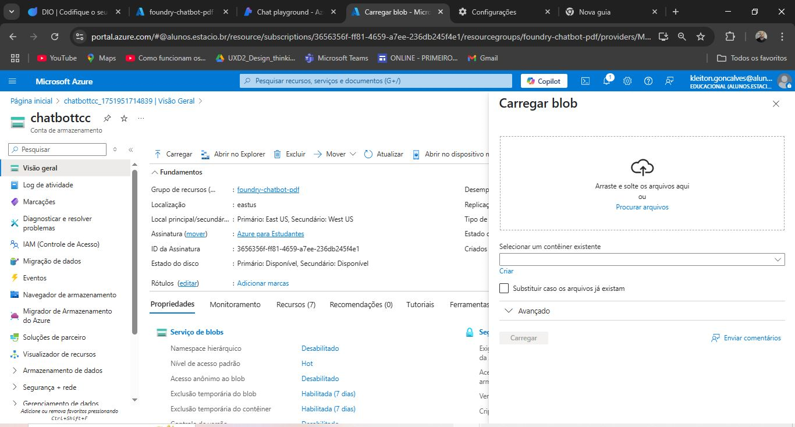
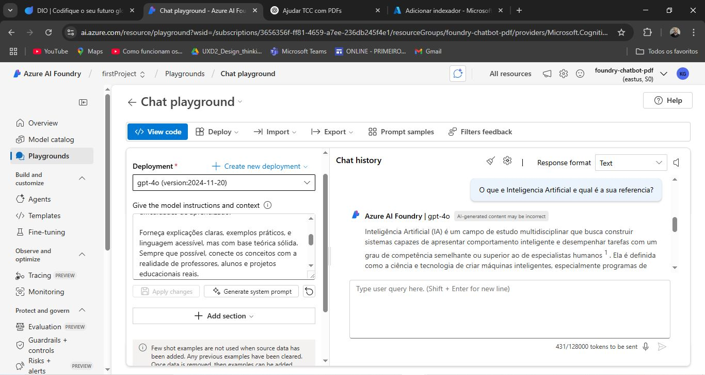
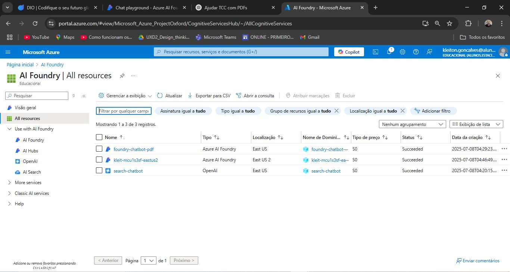

# Chatbot com PDFs usando Inteligência Artificial e Azure

## Visão geral

Este repositório apresenta o desenvolvimento de um chatbot inteligente que responde perguntas com base no conteúdo de arquivos PDF. O projeto foi desenvolvido como parte do desafio prático da DIO, utilizando recursos de inteligência artificial da Microsoft Azure, sem a necessidade de programação direta, por meio de ferramentas de baixo código.

O objetivo foi criar uma solução funcional que pudesse simular um assistente virtual acadêmico, com capacidade de interpretar conteúdos específicos e gerar respostas contextualizadas. Todo o processo foi conduzido com foco prático, explorando recursos da nuvem, como armazenamento, indexação e busca vetorial, aplicados de forma acessível para profissionais em transição de carreira.

## Funcionalidades

- Upload de arquivos PDF pessoais (ex: TCC, apostilas, artigos)
- Indexação automática do conteúdo via Azure Cognitive Search
- Criação de um chatbot com IA generativa via Azure AI Foundry
- Capacidade de responder perguntas baseadas exclusivamente no conteúdo enviado

## Tecnologias utilizadas

- Azure AI Foundry (Playground)
- Azure Cognitive Search
- Azure Blob Storage
- Interface gráfica baseada na plataforma Azure
- GitHub para versionamento e portfólio

## Estrutura do repositório

- `inputs/` - pasta de arquivos de exemplo utilizados para teste
- `prints/` - imagens das etapas do projeto no Azure
- `README.md` - documentação principal do projeto

## Prints do projeto

### Tela de configuração da conta de armazenamento (Blob Storage)

### Chatbot em funcionamento no Azure AI Foundry Playground

### Visão geral dos recursos criados no projeto

## Aprendizados

Este projeto proporcionou uma visão prática sobre o uso de IA generativa integrada a mecanismos de busca vetorial. Mesmo sem conhecimento avançado em programação, foi possível compreender e aplicar conceitos como embeddings, indexação semântica e uso de modelos de linguagem no contexto da nuvem Microsoft Azure.

Também foi possível desenvolver habilidades importantes como:

- Navegação e uso de serviços no portal do Azure
- Organização e estruturação de projetos em nuvem
- Aplicação de IA em cenários do mundo real, como suporte acadêmico
- Documentação técnica para portfólio

## Aplicações práticas

- Assistente virtual para estudantes e pesquisadores
- Central de dúvidas baseada em documentos internos
- Organização e consulta de materiais técnicos e institucionais
- Apoio a tarefas administrativas e educacionais com IA

## Considerações finais

Este projeto foi desenvolvido como parte do processo de transição de carreira para a área de tecnologia, com foco em inteligência artificial aplicada. Ele demonstra a capacidade de utilizar ferramentas modernas em nuvem para construir soluções reais e funcionais, mesmo partindo de um perfil não técnico.

O aprendizado adquirido durante o desenvolvimento amplia a compreensão sobre como a IA pode ser utilizada de forma prática e acessível, abrindo portas para oportunidades futuras no mercado de tecnologia.

## Contato

Este repositório faz parte do meu portfólio como aluno em formação. Caso queira entrar em contato, estou aberto para conexões, parcerias e oportunidades na área de tecnologia e inovação.
